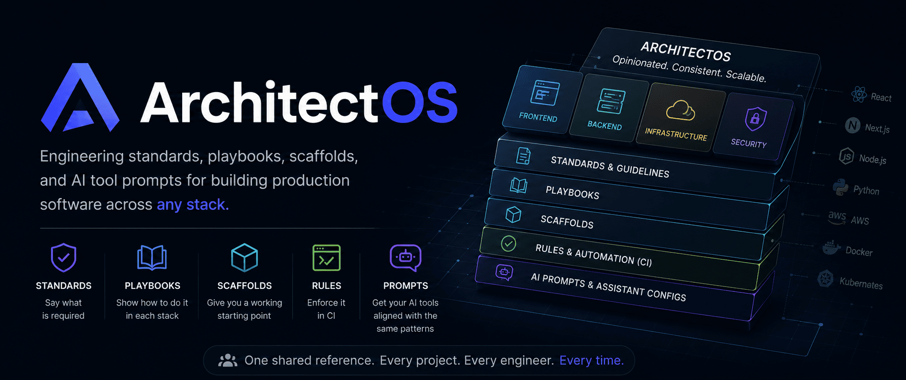

# ArchitectOS



[](LICENSE)

> Engineering standards, playbooks, scaffolds, and AI tool prompts for building production software across any stack.

ArchitectOS is an opinionated reference system for scalable application development. It covers frontend, backend, and infrastructure — with consistent standards, framework-specific playbooks, project scaffolds, and AI assistant configurations so your team ships with less friction and fewer surprises.

---

## Why ArchitectOS?

Most teams lose time to inconsistency: different folder structures on every project, security gaps nobody caught, new engineers guessing the "right" way to write a service. ArchitectOS is the shared reference that prevents that drift.

- **Standards** say what is required
- **Playbooks** show how to do it in each stack
- **Scaffolds** give you a working starting point
- **Rules** enforce it in CI
- **Prompts** get your AI tools aligned with the same patterns

---

## Install as Claude Code skills

```bash
npx skills@latest add riz007/architect-os
```

Pick the skills you want. Then run `/setup-architect-os` in Claude Code — it will ask which stack you're using and install the right AI tool configs.

**Available commands — all prefixed `aos-` so they're easy to find with tab-complete:**

| Command | What it does |
|---|---|
| `/aos-setup` | One-time setup — detects stack, writes AI tool configs |
| `/aos-scaffold <template> <name>` | Generate a new project (`vue`, `react`, `nestjs`, `fastapi`) |
| `/aos-review` | Review selected code against ArchitectOS standards |
| `/aos-feature <name> [stack]` | Generate a full feature (service + controller + DTOs + tests) |
| `/aos-audit` | Security audit — auth, IDOR, secrets, validation, headers |

Full command docs: [skills/README.md](skills/README.md)

---

## Quick Start

### Scaffold a new project

```bash
git clone https://github.com/riz007/ArchitectOS.git
cd ArchitectOS

# Vue 3 + TypeScript enterprise frontend
./tools/cli/scaffold.sh vue-enterprise my-frontend

# React 18 + TypeScript + React Query
./tools/cli/scaffold.sh react-enterprise my-app

# NestJS clean architecture API
./tools/cli/scaffold.sh nestjs-clean-arch my-service

# FastAPI + DDD Python API
./tools/cli/scaffold.sh fastapi-ddd my-api
```

### Configure your AI assistant

```bash
# Cursor — copy to project root
cp prompts/cursor/rules.md .cursorrules

# Windsurf — copy to project root
cp prompts/windsurf/rules.md .windsurfrules

# GitHub Copilot — copy to .github/
cp prompts/copilot/instructions.md .github/copilot-instructions.md

# Claude — copy to Claude config
cp prompts/claude/architect-os.md ~/.claude/instructions/architect-os.md

# Aider — copy to project root
cp prompts/aider/aider.conf.yml .aider.conf.yml

# Continue.dev — see prompts/continue/config.md for setup
```

### Validate a project

```bash
./tools/cli/validate.sh ./my-project
```

---

## Repository Structure

```
architect-os/
├── standards/          # Engineering contracts (coding, security, performance, git)
├── playbooks/          # Framework-specific implementation guides
├── scaffolds/          # Production-ready project templates
├── prompts/            # AI assistant configurations
├── rules/              # ESLint, validation, and security rules
├── examples/           # Complete reference applications
└── tools/              # CLI tools for scaffolding and validation
```

---

## Supported Technologies

### Frontend
- **Vue 3** — Composition API, TypeScript, Pinia, Vitest
- **React 18** — Hooks, React Query, Zustand, Vitest
- **Angular** — Standalone components, explicit DI, NgRx

### Backend
- **Node.js / NestJS** — Clean architecture, TypeORM, JWT
- **Python / FastAPI** — Pydantic, SQLAlchemy async, DDD
- **Java / Spring Boot** — Layered architecture, Spring Security

### Infrastructure
- **Docker** — Multi-stage builds, production-ready images
- **Kubernetes** — Deployments, services, health probes
- **GitHub Actions** — CI/CD, security scanning, release automation
- **Terraform** — Modular IaC, remote state, environment isolation

### AI Assistants
- **Claude** — Full system prompt with code standards and patterns
- **Cursor** — `.cursorrules` with framework-specific rules
- **Windsurf** — `.windsurfrules` with security and architecture rules
- **GitHub Copilot** — `.github/copilot-instructions.md`
- **Aider** — `.aider.conf.yml` + conventions file
- **Continue.dev** — Config with slash commands and context providers

---

## Standards

| Standard | Coverage |
|---|---|
| [Coding](standards/coding/README.md) | TypeScript, Python, Java — naming, structure, patterns |
| [Architecture](standards/architecture/README.md) | Clean architecture, layering, feature organization |
| [Security](standards/security/README.md) | OWASP, auth, secrets, input validation |
| [Performance](standards/performance/README.md) | Caching, N+1 prevention, async patterns |
| [Accessibility](standards/accessibility/README.md) | WCAG 2.1 AA compliance |
| [Git](standards/git/README.md) | Branching, conventional commits, PR process |
| [Reviews](standards/reviews/README.md) | Code review checklist and process |
| [Naming](standards/naming/README.md) | File, function, variable naming across stacks |

---

## Playbooks

| Playbook | Architecture | State | API | Testing | Performance |
|---|---|---|---|---|---|
| [Vue](playbooks/vue/) | ✔ | ✔ | ✔ | ✔ | ✔ |
| [React](playbooks/react/) | ✔ | ✔ | ✔ | ✔ | ✔ |
| [Angular](playbooks/angular/) | ✔ | ✔ | ✔ | ✔ | ✔ |
| [Node.js](playbooks/nodejs/) | ✔ | ✔ | ✔ | ✔ | ✔ |
| [NestJS](playbooks/nestjs/) | ✔ | ✔ | ✔ | ✔ | ✔ |
| [Python](playbooks/python/) | ✔ | ✔ | ✔ | ✔ | ✔ |
| [FastAPI](playbooks/fastapi/) | ✔ | ✔ | ✔ | ✔ | ✔ |
| [Java](playbooks/java/) | ✔ | ✔ | ✔ | ✔ | ✔ |
| [Docker](playbooks/docker/) | ✔ | — | — | — | — |
| [Kubernetes](playbooks/kubernetes/) | ✔ | — | — | — | — |
| [GitHub Actions](playbooks/github-actions/) | ✔ | — | — | — | — |
| [Terraform](playbooks/terraform/) | ✔ | — | — | — | — |

---

## Scaffolds

| Scaffold | Stack | Status |
|---|---|---|
| [vue-enterprise](scaffolds/vue-enterprise/) | Vue 3 + TypeScript + Pinia + Vitest | Ready |
| [react-enterprise](scaffolds/react-enterprise/) | React 18 + TypeScript + React Query + Zustand | Ready |
| [nestjs-clean-arch](scaffolds/nestjs-clean-arch/) | NestJS + TypeScript + TypeORM + clean architecture | Ready |
| [fastapi-ddd](scaffolds/fastapi-ddd/) | FastAPI + Pydantic + SQLAlchemy + DDD | Ready |

---

## Validation Rules

Automated rules that enforce standards in CI and pre-commit hooks:

- [Frontend rules](rules/frontend/README.md) — ESLint, no direct API calls in components, error boundaries
- [Backend rules](rules/backend/README.md) — Thin controllers, service layer enforcement
- [API rules](rules/api/README.md) — DTO validation, response shape standards
- [Database rules](rules/database/README.md) — N+1 prevention, parameterized queries
- [Security rules](rules/security/README.md) — JWT config, input validation, secrets management

---

## Examples

- [Fullstack SaaS](examples/fullstack-saas/README.md) — Vue 3 + NestJS + PostgreSQL + Stripe

---

## What it's not

ArchitectOS is not a low-code platform, a visual builder, an autonomous coding agent, or a framework-specific SDK. It is a reference system and a set of conventions — engineers still own every decision.

## Core Principles

1. **AI assists engineers** — humans own architecture and validation decisions
2. **Convention over chaos** — predictable structures that new engineers can navigate on day one
3. **Security by default** — OWASP-aligned patterns wired in from the start, not bolted on later
4. **Scalability first** — patterns that hold up as the codebase grows
5. **Framework abstraction** — business logic that doesn't leak framework details

---

## Contributing

See [CONTRIBUTING.md](CONTRIBUTING.md) for guidelines. Key areas where contributions are welcome:

- Additional stack playbooks (Go, Svelte, Rust, .NET)
- Improved scaffold implementations
- New examples and reference applications
- Additional AI tool integrations
- Corrections and improvements to existing standards

---

## Roadmap

- **Phase 1** ✅ Standards, playbooks, prompts, and validation rules
- **Phase 2** ✅ Scaffolding engine with CLI tools
- **Phase 3** 🚧 AI review engine (automated PR feedback against standards)
- **Phase 4** Planned Multi-agent orchestration for full-stack generation

---

## License

MIT — see [LICENSE](LICENSE).
